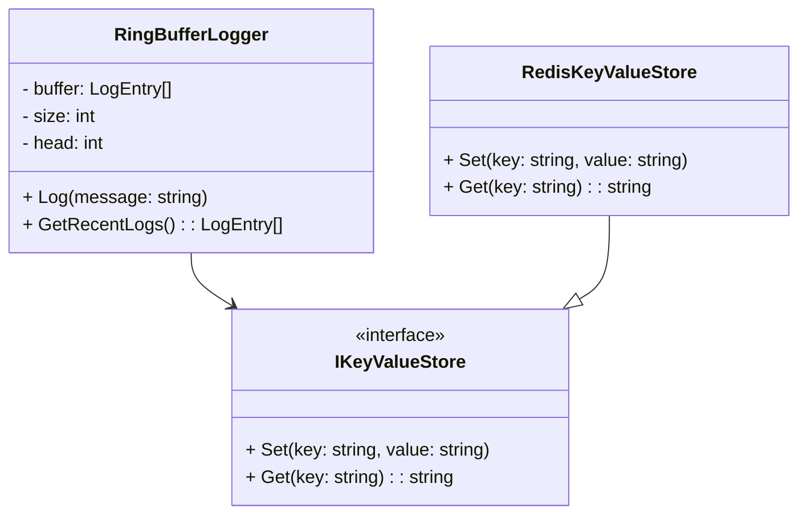
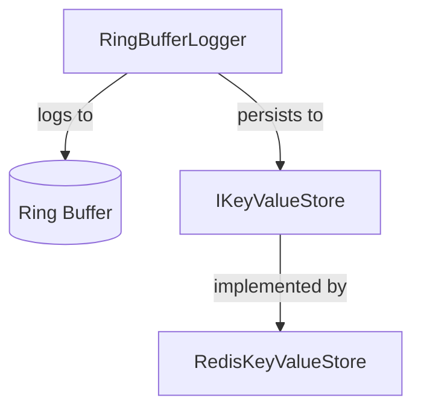

# RingBufferLogging

RingBufferLogging is a .NET library that provides a high-performance, in-memory logging solution using a ring buffer data structure. It is designed for scenarios where you need to capture and retain a fixed number of recent log entries, with optional persistence to external key-value stores such as Redis.

## Features
- **Ring Buffer Logger**: Efficiently stores log entries in a fixed-size buffer, overwriting the oldest entries when full.
- **Key-Value Store Abstraction**: Easily integrate with external stores (e.g., Redis) for log persistence or sharing across processes.
- **Extensible Design**: Interfaces allow for custom key-value store implementations.
- **Unit Tests**: Comprehensive test coverage for core components.

## Project Structure



## Component Overview



## Getting Started

1. Reference the `RingBufferLogging` project in your solution.
2. Use `RingBufferLogger` to log messages in-memory.
3. Optionally, configure a key-value store (e.g., `RedisKeyValueStore`) for persistence.

## Example Usage

```csharp
var logger = new RingBufferLogger(100); // buffer size 100
logger.Log("Application started");
var recentLogs = logger.GetRecentLogs();
```

## Tests
Unit tests are located in the `RingBufferLogging.Tests` project and cover:
- Ring buffer logic
- Redis key-value store integration

## License
MIT License
